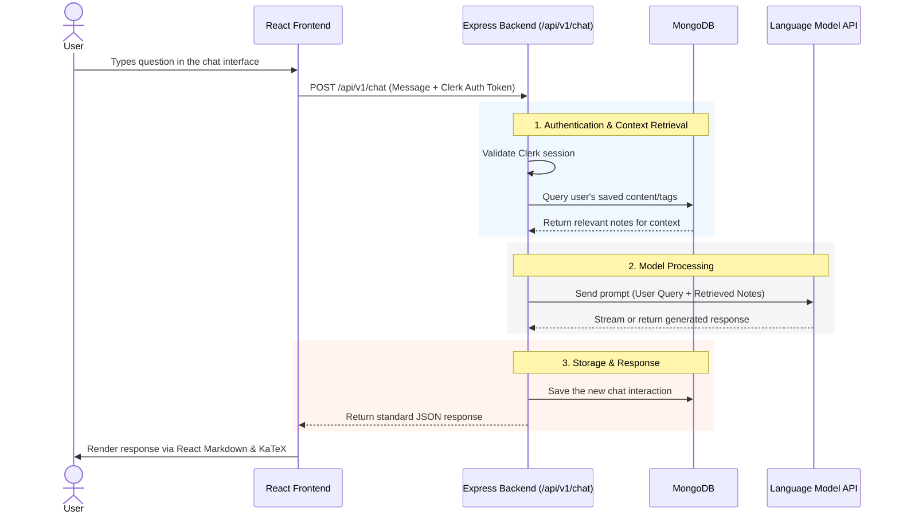
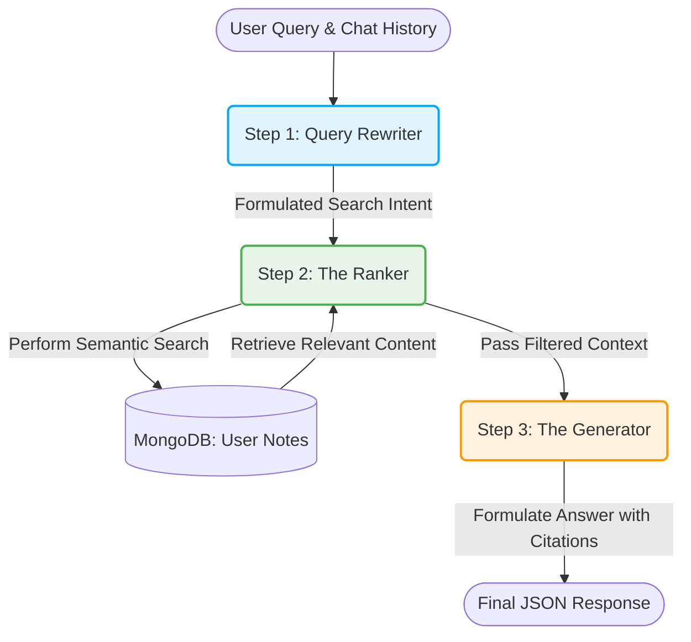

# Second Brain


**Second Brain** is a personal knowledge management application designed to help you capture, organize, and retrieve your thoughts, links, and notes effectively. It offers a secure, streamlined workspace where you can store your ideas and easily recall them whenever needed.

---

## Core Features

- **Secure Authentication**: Robust user login and identity management via Clerk.
- **Rich Content Creation**: Full support for Markdown formatting alongside complex math formula rendering (KaTeX).
- **Custom Organization**: Keep your knowledge neatly categorized using custom tags.
- **Shareable Content**: Seamlessly generate public, shareable links for individual notes and curated collections.
- **Smart Chat Interface**: Chat with your saved notes natively via a sophisticated Language Model API integration.

## Tech Stack

### Frontend (`/client`)
- **React 19** & **Vite**: Blazing fast UI development and builds.
- **TypeScript**: Static typing for robust application logic.
- **Tailwind CSS** & **Framer Motion**: Beautiful utility-first styling with fluid animations.
- **Clerk**: Comprehensive user authentication.
- **React Router DOM**: Client-side routing.
- **React Markdown, Remark Math, & Rehype KaTeX**: Extensive markdown parsing and dynamic math rendering.

### Backend (`/server`)
- **Node.js** & **Express.js**: Fast, scalable server-side infrastructure.
- **TypeScript**: Fully typed API endpoints.
- **MongoDB & Mongoose**: Flexible, schema-based NoSQL database management.
- **CORS** & **dotenv**: Secure cross-origin resource sharing and environment variable management.

## Project Structure

This project follows a monorepo setup:

```
2ndBrain/
├── client/     # Frontend React application (Vite)
└── server/     # Backend Express.js API
```

## API Routes Summary

The backend exposes the following core RESTful endpoints:

| Route Prefix         | Description                                                          |
|----------------------|----------------------------------------------------------------------|
| `/api/v1/user`       | Handles user metadata and account-related operations.                |
| `/api/v1/content`    | Core CRUD operations for notes, links, and text content.             |
| `/api/v1/tag`        | Creation, assignment, and management of organizational tags.         |
| `/api/v1/share`      | Generation, retrieval, and revocation of public shareable links.     |
| `/api/v1/chat`       | Routes processing Language Model API queries against user content.   |

## Local Setup Instructions

Follow these steps to run the application locally.

### 1. Clone the repository
```bash
git clone <repository-url>
cd 2ndBrain
```

### 2. Install Dependencies
You need to install dependencies for both the frontend and the backend.

**Root terminal:**
```bash
# Install frontend dependencies
cd client
npm install

# In a new terminal tab, install backend dependencies
cd ../server
npm install
```

### 3. Environment Variables
You must set up environment variables in both the `client` and `server` directories.

**Frontend (`client/.env`)**
Create a `.env` file in the `client` directory:
```env
VITE_CLERK_PUBLISHABLE_KEY=your_clerk_publishable_key
```

**Backend (`server/.env`)**
Create a `.env` file in the `server` directory:
```env
PORT=3000
MONGODB_URI=your_mongodb_connection_string
FRONTEND_URL=http://localhost:5173
```

### 4. Start the Application

**Run Frontend:**
```bash
cd client
npm run dev
```

**Run Backend:**
```bash
cd server
npm run dev
```

---

## Chat Architecture & Workflow

This document outlines the architecture and data flow for the integrated chat feature within the Second Brain application. The system securely connects the React frontend, Express backend, MongoDB, and the Language Model API to provide context-aware responses based on user-saved notes.

### System Architecture

The following sequence diagram illustrates the step-by-step lifecycle of a single chat request.



### 3-Step Chat Pipeline

Behind the scenes, the Express backend executes a sophisticated 3-step pipeline to ensure high-quality, context-aware responses:




---

### Author

Yours Lovingly!! <br>
<b>ABHINEET ANAND</b>
